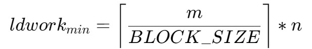
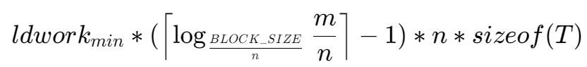

# tsqr
tsqr 对尺寸为 m * n 且 m 远大于 n 的列主序矩阵 A 做 QR 分解。

使用方法:
```bash
make
./test_tsqr 16384 32 2
```

## 接口
```c
template <typename T>
void tsqr(cublasHandle_t cublas_handle, int m, int n, T *A, int lda, T *R,
          int ldr, T *work, int ldwork)
```

- `T`：计算的数据类型，支持 float 和 double；
- `cublas_handle`：cublas 句柄；
- `m`：矩阵 A 和矩阵 Q 的高度；
- `n`：矩阵 A 和矩阵 Q 的宽度、矩阵 R 的高度和宽度；
- `A`：矩阵 A 的地址，计算后被矩阵 Q 覆盖；
- `lda`：矩阵 A 和矩阵 Q 的首维度大小；
- `R`：矩阵 R 的地址；
- `ldr`：矩阵 R 首维度大小；
- `ldwork`：工作空间首维度大小，最小为：



- `work`：分解所需工作空间的地址，分配的空间最小为：



`BLOCK_SIZE`为算法内部分块大小，即[TallShinnyQR.h](TallShinnyQR.h)中的 TSQR_BLOCK_SIZE
